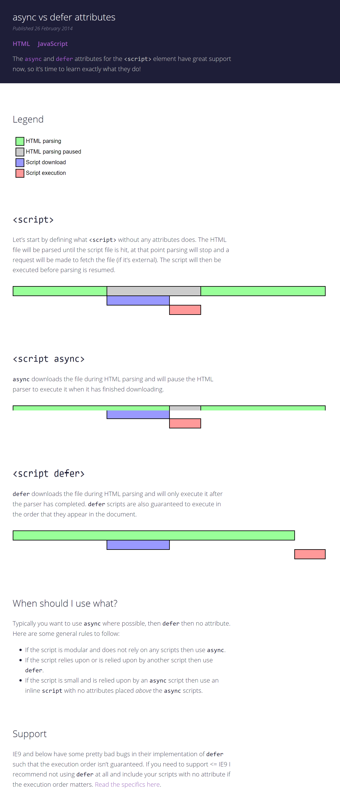

## 序

> 1. **工业革命是钢铁铸就的，互联网革命则是 JavaScript 造就的**
> 2. JavaScript 是目前唯一可以随处部署的语言：服务器、桌面浏览器、手机浏览器，甚至原生移动应用程序中都有它的身影

## 前言

> 1. 谷歌一位技术经理：**JavaScript 并不是一门真正有内聚力的编程语言，至少形式上不是**
>    （1）ECMA-262 规范定义了 JavaScript，但 JavaScript 没有唯一正确的实现
>
>    ​		——各种浏览器及其 JavaScript 引擎都按照自己的理解实现各种规范：
>
>    ​			Chrome：Blink/V8
>
>    ​			Firefox：Gecko/SpiderMonkey
>    ​			Safari：WebKit/JavaScriptCore
>
>    ​			微软：Trident/EdgeHTML/Chakra
>
>    （2）JavaScript 与其宿主关系密切
>
>    ​		——实际上宿主为 JavaScript 定义了与外界交互所需的全部 API：DOM、网络请求、系统硬件、存储、事件、文件、加密，还有数以百计的其他 API
>
>    **如果没有 JavaScript，那么现代 Web 势必发生严重倒退**
>    
> 2. 通过学习本书，读者可以**透彻地理解如何渲染恰当的 JavaScript 技术，以解决现实开发中遇到的业务问题**

## 第 1 章：什么是 JavaScript

> 1. 1995 年，JavaScript 问世。当时，它的主要用途是代替 Perl 等服务器端语言处理输入验证
> 2. 从简单的输入验证脚本到强大的编程语言，JavaScript 的崛起没有任何人预测到——它很简单，学会用只要几分钟；它又很复杂，掌握它要很多年——要真正学号用好 JavaScript，理解其**本质、历史及局限性**是非常重要的

#### 1.1 简短的历史回顾

#### 1.2 JavaScript 实现

> 1. 完整的 JavaScript 实现包含：
>    	——核心：ECMAScript
>
>    ​	——文档对象模型：DOM（Document Object Model）
>
>    ​	——浏览器对象模型：BOM（Browser Object Model）

##### 1.2.1 ECMAScript

> 1. ECMAScript，是 ECMA-262 定义的语言
> 2. ECMAScript 并不局限于 Web 浏览器——Web 浏览器只是 ECMAScript  实现可能存在的一种宿主环境（host environment）
>    ——宿主环境提供 ECMAScript 的基准实现和与环境交互必需的扩展
>    ——扩展（比如 DOM）使用ECMAScript 核心类型和语法，提供特定于环境的额外功能
>    ——**其他宿主环境**还有服务器端 JavaScript 平台 Node.js 和 即将被淘汰的 Adobe Flash

###### 1. ECMAScript 版本

###### 2. ECMAScript 符合性是什么意思

> 1. ECMA-262 阐述了什么是 ECMAScript 符合性。要成为 ECMAScript 实现，必须满足下列条件：
>
>    - 支持 ECMA-262 中描述的所有 “类型、值、对象、属性、函数，以及城乡语法与语义”；
>    - 支持 Unicode 字符标准
>    - 【可选】增加 ECMA-262 中未提及的 “额外的类型、值、对象、属性和函数”
>    - 【可选】支持 ECMA-262 中没有定义的 “程序和正则表达式语法”（意思是允许修改和扩展内置的正则表达式特性，而不是说 ECMA-262 没有定义 “程序和正则表达式语法”）
>
>    **以上条件为实现开发者基于 ECMAScript 开发语言提供了极大的权限和灵活度**，也是其广受欢迎的原因之一

###### 3. 浏览器对 ECMAScript 的支持

> 1. 到了 2008 年，五大浏览器（IE、Firefox、Safari、Chrome 和 Opera）全部兼容 ECMA-262 第 3 版
> 2. IE 8 率先实现 ECMA-262 第 5 版，并在 IE 9 中完整支持

##### 1.2.2 DOM

> 1. 文档对象模型（DOM）是一个应用编程接口（API），**用于在 HTML 中使用扩展的 XML**（？？？）
> 2. DOM 将整个页面抽象为一组分层节点：HTML 或 XML 页面的每个组成部分都是一种节点，包含不同的数据
> 3. DOM 通过创建表示文档的树，让开发者可以随心所欲地**控制网页的内容和结构**。使用 DOM API，可以轻松地**删除、添加、替换、修改节点**。

###### 1. 为什么 DOM 是必需的

> 1. IE4 和 Netscape Navigator 4 支持不同形式的动态 HTML（DHTML），使得可以做到不刷新页面而修改页面外观和内容——但是，网景和微软采用不同思路开发 DHTML，因此不能做到写一个 HTML 页面就可以在任何浏览器中运行
> 2. 为了保持 Web 跨平台的本性，万维网联盟（W3C，World Wide Web Consortium）开始了制定 DOM 标准的进程

###### 2. DOM 级别

> ​	DOM 并非只能通过 JavaScript 访问，而且确实被其他语言实现了。不过对于浏览器来说，DOM 就是使用 ECMAScript 实现的，如今已经成为 JavaScript 语言的一大组成部分

> 1. 1998 年 10 月，**DOM Level 1** 成为 W3C 的推荐标准。这个规范由两个模块组成：DOM Core 和 DOM HTML
>    ——DOM Core：提供了一种映射 XML 文档，从而方便访问和操作文档任意部分的方式
>    ——DOM HTML：扩展了 DOM Core，并增加了特定于 HTML 的对象和方法
> 2. DOM Level 1 的目标是映射文档结构，而 **DOM Level 2** 的目标则宽泛得多。DOM Level 2 新增了一下模块，以支持新的接口：
>    - DOM 视图：描述追踪文档不同视图（如应用 CSS 样式前后的文档）的接口
>    - DOM 事件：描述事件及事件处理的接口
>    - DOM 样式：描述处理元素 CSS 样式的接口
>    - DOM 遍历和范围：描述遍历和操作 DOM 树的接口
>    - DOM Core：被扩展以包含对 XML 命名空间的支持
> 3. **DOM Level 3** 进一步扩展了 DOM：
>    - DOM Load and Save：以统一的方式加载和保存文档的方法
>    - DOM Validation：验证文档的方法
>    - DOM Core：被扩展支持所有 XML 1.0 的特性，包括 XML Infoset、XPath 和 XML Base
> 4. **目前，W3C 不在按照 Level 来维护 DOM 了，而是作为 DOM Living Standard 来维护，其快照称为 DOM 4**。DOM 4 新增的内容包括替代 Mutation Events 的 Mutation Observers

> ​	PS：并没有一个标准叫 “DOM Level 0”，这只是 DOM 历史中的一个参照点——DOM Level 0 可以看作 IE 4 和 Netscape Navigator 4 中最初支持的 DHTML

###### 3. 其他 DOM

> 1. 除了 DOM Core 和 DOM HTML 接口，有些其他语言也发布了自己的 DOM 标准
>    ——基于 XML 的语言：
>
>    - 可伸缩矢量图（SVG，Scalable Vector Graphics）
>    - 数学标记语言（MathML，Mathematics Markup Language）
>    - 同步多媒体集成语言（SMIL，Synchronized Multimedia Integration Language）
>
>    ——XML 用户界面语言（XUL，XML User Interface Language）

###### 4. Web 浏览器对 DOM 的支持情况

> 1. DOM 标准在 Web 浏览器实现它之前就已经作为标准发布了
> 2. 支持 DOM 是浏览器厂商的重中之重，每个版本发布都会改进支持度

##### 1.2.3 BOM

> 1. IE 3 和 Netscape Navigator 3 提供了浏览器对象模型（BOM） API，**用于支持访问和操作浏览器的窗口**——使用 BOM，开发者可以操控**浏览器显示页面之外的部分**
>
> 2. BOM 真正独一无二，同时也是问题最多的地方，即它是**唯一一个没有相关标准的 JavaScript 实现**——HTML 5 改变了这个局面，这个版本的 HTML 以**正式规范的形式**涵盖了尽可能多的 BOM 特性。由于 HTML 5 的出现，之前很多与 BOM 有关的问题都迎刃而解了
>
> 3. 总体来说，BOM 主要针对浏览器窗口和子窗口（frame），不过人们通常会**把任何特定于浏览器的扩展都归在 BOM 的范畴内**。比如，下面就是这样一些扩展：
>
>    - 弹出新浏览器窗口的能力
>    - 移动、缩放和关闭浏览器窗口的能力
>    - navigator 对象：提供关于浏览器的详尽信息
>    - location 对象：提供浏览器加载页面的详尽信息
>    - screen 对象：提供关于用户屏幕分辨率的详尽信息
>    - performance 对象，提供浏览器内存占用、导航行为和时间统计的详尽信息
>    - 对 cookie 的支持
>    - 其他自定义对象，如 XMLHTTPRequest 和 IE 的 ActiveXObject
>
>    PS：**不妨在浏览器控制台输入 window、window.performance、Object.keys(window)【length=227】  /  Object.getOwnPropertyNames(window)【length=1006】 尝试一下**
>
> 4. 因为在很长时间内都没有标准，所以每个浏览器实现的都是自己的 BOM。当然，现在有了 HTML 5，BOM 的实现细节应该会日趋一致。

#### 1.3 JavaScript 版本

> 1. 作为网景的继承者，Mozilla 是唯一仍在延续最初 JavaScript 版本编号的浏览器厂商
> 2. 多数浏览器对 JavaScript 的支持，指的是**实现 ECMAScript 和 DOM 的程度**


#### 第 2 章：HTML 中的 JavaScript

> 1. 将 JavaScript 引入网页，首先要解决它**与网页的主导语言 HTML 的关系问题**
>    ——JavaScript 早期，网景公司的工作人员希望在将 JavaScript 引入 HTML 页面的同时，不会导致页面在其他浏览器中渲染出问题  =>  达成向网页中引入**通用脚本能力**的共识  =>  最终形成 HTML 规范

##### 2.1 &lt;script&gt;元素

> 1. **将 JavaScript 插入 HTML 的主要方法是使用 &lt;script&gt; 元素**——这个元素是由网景公司创造出来，并最早在 Netscape Navigator 2 中实现的  =>  这个元素后来被正式加入到 HTML 规范
> 2. &lt;script&gt; 元素有下列 8 个属性：

|          属性           |   状态   |                             描述                             |
| :---------------------: | :------: | :----------------------------------------------------------: |
|           src           |   可选   |                表示包含要执行的代码的外部文件                |
|        language         | **废弃** | 最终用于表示代码块中的脚本语言（如 "JavaScript"、"JavaScript 1.2" 或 "VBScript"）<br />大多数浏览器都会忽略这个属性，不应该再使用它 |
|    type<sup>*</sup>     |   可选   | 代替 language，代替代码块中脚本语言的内容类型（也称 **MIME 类型**） |
|          async          |   可选   | 表示应该立即开始下载脚本，但不能阻止**其他页面**动作，比如下载资源或等待其他脚本加载<br />——只对外部脚本文件有效 |
|          defer          |   可选   | 表示脚本可以延迟到文档完全被解析和显示之后再执行<br />——只对外部脚本文件有效<br />——在 IE 7 及更早的版本中，对行内脚本也可以指定这个属性 |
|         charset         |   可选   | 使用 src 属性指定的代码字符集<br />——这个属性很少使用，因为大多数浏览器不在乎它的值 |
| crossorigin<sup>*</sup> |   可选   |         配置相关请求的 CORS设置<br />——默认使用 CORS         |
|        integrity        |   可选   | 允许比对接收到的资源和指定的加密签名，以验证子资源完整性（SRI，Subresource Integrity）<br />—— |

> ​		2.1 type：
> ​			——按照惯例，type 的值始终都是 "text/javascript"，尽管 "text/javascript" 和 "text/ecmascript" 都已经废弃了
> ​			——JavaScript 文件的 MIME 通常是 "application/x-javascript"，不过给 type 属性这个值有可能导致脚本被忽略
> ​			——在非 IE 的浏览器中有效的其他值还有 "application/javascript" 和 "application/ecmascript"
> ​			——如果这个值是 module，则代码会被当成 ES 6 模块，而且只有这时候代码中才能出现 import 和 export 关键字
>
> ​		2.2 crossorigin：
> ​			——crossorigin="anonymous"：配置文件请求不必设置凭据标志
> ​			——crossorigin="use-credentials"：设置凭据标志，意味着出站请求会包含凭据
>
> 3. 使用 &lt;script&gt; 的方式有两种：
>    3.1 直接在网页中嵌入 JavaScript 代码
>
>    ​	（1）包含在 &lt;script&gt; 内的代码会被从上到下解释
>
>    ​	（2）在 &lt;script&gt; 元素中的代码被计算完成之前，**页面的其余内容不会被加载**，也不会被显示
>
>    ​	（3）浏览器解析行内脚本的方式决定了：浏览器在看到字符串&lt;/script&gt;时，会将其当成结束的&lt;/script&gt;标签——因此，需要对其进行转义
>
>    3.2 在网页中包含外部 JavaScript 文件
>
>    ​	（1）要包含外部文件中的 JavaScript，必须使用 src 属性
>    ​			——使用了 src 属性的&lt;script&gt;元素不应该再在其中包含其他 JavaScript 代码，因为如果两者都提供的话，**浏览器只会下载并执行脚本文件，而忽略行内代码**
>
>    ​			——与&lt;img&gt;类似，&lt;script&gt;元素的 src 属性可以是一个完整的 URL，**而且这个 URL 指向的资源可以跟包含它的 HTML 页面不在同一个域中**——来自外部域的代码会被当成加载它的页面的一部分来加载和解释：这个功能可以让我们**通过不同的域分发 JavaScript**
>    ​				（1）引用了放在别人服务器上的 JavaScript 文件时要格外小心，因为恶意的程序员随时可能替换这个文件：在包含外部域的 JavaScript 文件时，要确保该域是自己所有的，或者该域是一个可信的来源——&lt;script&gt;标签的 integrity 属性是防范这种问题的一个武器，但这个属性并非所有浏览器都支持
>    ​				（2）浏览器在解析 src 属性的 URL 资源时，会向该 URL 发送一个 GET 请求，以取得相应资源，并假定该资源是一个 JavaScript 文件——初始的 GET 请求会受父页面 HTTP/HTTPS 协议的限制，但不会受浏览器同源策略限制。另外，返回并被执行的 JavaScript 会受浏览器同源策略限制
>
>    ​	（2）与解释行内 JavaScript 一样，在解释外部 JavaScript 文件时，页面也会阻塞（阻塞时间也包含下载文件的时间）

###### 2.1.1 标签位置

> 1. 现代 Web 应用程序通常将所有 JavaScript 引用放在**&lt;body&gt;元素中的内容**后面

###### 2.1.2 推迟执行脚本

> 1. HTML 4.01 新增 defer 属性：**告诉浏览器中止 HTML 解析，立即下载外部脚本文件，但延迟到整个页面都解析完毕后再执行**
> 2. HTML 5 明确规定：defer 属性只对外部脚本文件才有效——因此，支持 HTML 5 的浏览器会忽略行内脚本的 defer 属性
> 3. 对 defer 属性的支持是从 IE4,、Firefox3.5、Safari5 和 Chrome7 开始的，**其他所有浏览器则会忽略这哦属性，按照通常的做法来处理脚本**——考虑到这一点，还是把要推迟执行的脚本放在页面底部比较好

###### 2.1.3 异步执行脚本

> 1. HTML 5 为 &lt;script&gt;元素定义了 async 属性：**告诉浏览器在 HTML 解析的同时异步下载外部脚本文件，并在下载完成后中止 HTML 解析，执行下载的脚本**



###### 2.1.4 动态加载脚本

> 1. 通过向 DOM 中动态添加 script 元素同样可以加载指定的脚本——只要创建 script 元素并将其添加到 DOM 即可
>
>    ```js
>    let script = document.createElement('script');
>    script.src = 'gibberish.js';
>    document.head.appendChild(script);
>    ```
>
> 2. 默认情况下，以这种方式创建的 &lt;script&gt; 元素是以异步方式加载的，相当于添加了 async 属性。但是，这样做可能会有问题：虽然所有浏览器都支持 createElement() 方法，但并非所有浏览器都支持 async 属性——因此，如果要统一动态脚本的加载行为，可以明确将其设置为同步加载：
>
>    ```js
>    // ...
>    script.async = false;
>    // ...
>    ```
>
> 3. 以这种方式获取的资源**对浏览器预加载器是不可见的**——这会严重影响它们在资源获取队列中的优先级。
>    （1）根据应用程序的工作方式以及怎么使用的不同，这种方式可能存在严重影响性能的可能
>    （2）要想让预加载器知道这些动态请求文件的存在，可以**在文档头部显式声明**他们：
>
>    ```js
>    <link rel="preload" href="gibberish.js">
>    ```

###### 2.1.5 XHTML 中的变化

###### 2.1.6 废弃的语法

> 1. type 属性使用一个 MIME 类型字符串来标识 &lt;script&gt; 的内容，但 MIME 类型并没有跨浏览器标准化——即使浏览器默认使用 JavaScript，在某些情况下某个无效或无法是被的 MIME 类型也可能导致浏览器跳过（不执行）相关代码
>
> 2. 为了兼容不支持 JavaScript 的浏览器，可以把脚本代码包含在一个 HMTL 注释中，这样就可以隐藏嵌入的 JavaScript 代码——使用这种格式，不支持 JavaScript 的浏览器就可以忽略&lt;script&gt;标签中的内容，而支持 JavaScript 的浏览器则必须识别这种模式，将其中的内容作为 JavaScript 来解析
>
>    ```html
>    <script><!--
>    	function sayHi() {
>        	console.log("Hi!");
>    	}
>    //--></script>
>    ```
>
> 3. 虽然之中格式仍然可以被所有浏览器识别和解析，但**已经不再必要，而且不应该再使用了**

##### 2.2 行内代码和外部文件

> 1. 通常认为最佳实践是尽可能将 JavaScript 代码放在外部文件中
>    （1）可维护性：用一个目录保存所有 JavaScript 文件，相比将 JavaScript 代码分散到很多 HTML页面，更容易维护
>    （2）缓存：浏览器会根据特定的设置，缓存所有外部连接的 JavaScript 文件——这意味着，如果两个页面都用到同一个文件，则该文件只需下载一次
>    （3）适应未来：把 JavaScript 放到外部文件中，就不必考虑用 XHTML 或前面所提到的 HTML 注释
> 2. 如果使用外部文件，则需要考虑它们占用多少带宽：**在 SPDY/HTTP2 中，预请求的消耗已经显著降低，以轻量、独立 JavaScript 组件形式向客户端送达脚本更具优势**——当然，如果浏览器不支持 SPDY/HTTP2，可能还是用一个大文件更合适

##### 2.3 文档模式

> 1. IE 5.5 发明了文档模型的概念，即可以使用 doctype 切换文档模式
>
> 2. 最初的文档模型有两种：混杂模式（quirks mode）和标准模式（standards mode）。随着浏览器的普遍实现，又出现了第三种文档模式：准标准模式（almost standards mode）
>    （1）混杂模式：让 IE 向 IE 5 一样（支持一些非标准的特性）
>    （2）标准模式：让 IE 具有兼容标准的行为
>    （3）准标准模式：支持很多标准的特性，但又没有标准定地那么严格——主要区别在于如何对待图片元素周围的空白（在表格中使用图片时最明显）
>
>    > PS：混杂模式和标准模式的主要区别**只体现在通过 CSS 渲染的内容方面**，但对 JavaScript 也有一些关联影响，或成为副作用
>
> 3. 混杂模式在所有浏览器中都以省略文档开头的 doctype 声明作为开关——这种约定并不合理，因为混杂模式在不同浏览器中的差异非常大，不适用黑科技基本上就没有浏览器一致性科研
>
> 4. 标准模式通过下列几种文档类型声明开启：
>    
>
> 5. 准标准模式通过过渡性文档类型（Transition）和框架集文档类型（Frameset）来触发：
>    
>
>    > 准标准模式与标准模式非常接近，很少需要区分，甚至可以统称为标准模式

##### 2.4 &lt;noscript&gt;元素

> 1. 针对早期浏览器不支持 JavaScript 的问题，需要一个页面优雅降级的处理方案。最终&lt;noscript&gt;元素出现，**被用于给不支持 JavaScript 的浏览器提供替代内容**
>    ——虽然如今的浏览器已经 100% 支持 JavaScript，但对于禁用 JavaScript 的浏览器来说，这个元素仍然有它的用处
> 2. &lt;noscript&gt;元素可以包含任何除 &lt;script&gt; 元素之外的可以出现在 &lt;body&gt; 中的 HTML 元素
> 3. 在下列两种情况下，浏览器将显示包含在 &lt;noscript&gt; 中的内容：
>    （1）浏览器不支持脚本
>    （2）浏览器对脚本的支持被关闭

#### 第 3 章：语言基础

> 1. 任何语言的核心所描述的都是这门语言在**最基本的层面上**如何工作，设计语言、操作符、数据类型以及内置功能，在此基础上才可以构建复杂的解决方案
> 2. ECMA-262 以一个名为 ECMAScript 的伪语言的形式，定义了 JavaScript 的所有这些方面

##### 3.1 语言

> 1. ECMAScript 的语言很大程度上借鉴了 C 语言和其他类 C 语言，如 Java 和 Perl

###### 3.1.1 区分大小写

###### 3.1.2 标识符

> 1. 所谓标识符，就是变量、函数、属性或函数参数的名称
>    ——第一个字符必须是一个字母、下划线（_）或美元符号（$）
>
>    ——剩下的其他字符可以是字母、下划线、美元符号或数字
>
> 2. 按照惯例，ECMAScript 标识符使用驼峰大小写形式，即第一个单词的首字母小写，后面每个单词的首字母大写——虽然这种写法并不是强制性的，但因为这种形式跟 ECMAScript 内置函数和对象的命名方式一致，所以算是最佳实践

###### 3.1.3 注释

> 1. ECMAScript 采用 C 语言风格的注释，包括单行注释和块注释
>    （1）单行注释：//
>    （2）块注释：/* */

###### 3.1.4 严格模式

> 1. ES 5 增加了严格模式（strict mode）的概念：严格模式是一种不同的 JavaScript 解析和执行模式
> 2. 要对整个脚本启用严格模式，需要在脚本的开头加上 "use strict"——这是一个**预处理指令**，任何支持的 JavaScript 引擎看到它都会切换到严格模式
> 3. 也可以单独指定一个函数在严格模式下执行，只要把这个预处理命令放到函数体开头即可

###### 3.1.5 语句

> 1. ECMAScript 中的语句以分号结尾——省略分号意味着由解析器确定语句在哪里结尾，**但并不推荐**
>    （1）加分号有助于防止省略造成的问题：比如可以避免输入内容不完整
>    （2）加分号也便于开发者通过删除空行来压缩代码：如果没有结尾的分号，只删除空行，则会导致语法错误
>    （3）加分号也有助于在某些情况下提升性能：因为解析器会尝试在合适的位置上补上分号以纠正语法错误
> 2. 多条语句可以合并到一个 C 语言风格的代码块中——代码块用花括号表示
>    （1）if 之类的控制语句只在执行多条语句时要求必须有代码块。不过，最佳实践是始终在控制语句中使用代码块，即使要执行的只有一条语句
>    （2）在控制语句中使用代码块可以让内容更清晰，在需要修改代码时也可以减少出错的可能性

##### 3.2 关键字与保留字

> 1. 按照规定，保留的关键字不能用作标识符或属性名：
>    
> 2. 规范中也描述了一组未来的的保留字，同样不能用作标识符或属性名：
>    

##### 3.3 变量

> 1. ECMAScript 变量是松散类型的——这意味着可以用于保存任何类型的数据——每个变量只不过是用于保存任意值的**命名占位符**

###### 3.3.1 var

> 1. 用于定义变量
>    ——不初始化时，定义的变量会保存一个特殊值 undefined
>    ——进行初始化时，并不会将该变量标识为对应类型，只是一个简单的赋值而已
> 2. 声明作用域
>    ——var 定义的变量会成为包含它的函数的局部变量
>    ——函数内，省略 var 定义的变量会成为全局变量
> 3. 如果需要定义多个变量，可以在一条语句中用逗号分隔每个变量（及可选的初始化）
> 4. 声明提升：var 声明的变量会自动提升到函数作用域顶部
> 5. 允许重复声明

###### 3.3.2 let

> 1. let 声明的范围是块作用域——var 声明的范围是函数作用域
> 2. 不允许同一个块作用域中出现重复声明（var 和 let 混用，重复声明也不行）
> 3. let 声明的变量不会在作用域中被提升——在 let 声明之前的执行瞬间被称为 "暂时性死区"（Temporary Dead Zone），在此阶段引用任何后面才声明的变量都会抛出 ReferenceError
> 4. let 在全局作用域中声明的变量不会成为 window 对象的属性——var 声明的变量会
> 5. 条件声明：**不能使用 let 进行条件式声明**
> 6. for 循环中的 let 声明
>    （1）var 声明的 for 循环迭代变量会渗透到循环体外部
>    （2）let 声明的 for  循环迭代变量的作用域仅限于 for 循环块内部，因此不会渗透到循环体外部——使用 let 声明迭代变量时，JavaScript 引擎**在后台会为每个迭代循环声明一个新的迭代变量**，在某次循环中引用的都是不同的变量实例，而不是一个最终值

###### 3.3.3 const

> 1. const 与 let 唯一一个重要的区别是用它声明变量时必须同时初始化变量，且尝试修改 const 声明的变量会导致运行时错误
> 2. const 声明的限制只适用于它指向的变量的引用——这意味着，如果 const 变量引用的是一个对象，那么修改这个对象内部的属性并不违反 const 限制
> 3. 不能用 const 来声明迭代变量，因为迭代变量会自增——不过，可以使用 const 声明一个不会被修改的 for 循环变量

###### 3.3.4 声明风格及最佳实践

> 1. 不适用 var：限制自己只使用 let 和 const 有助于提升代码质量，因为变量有了明确地作用域、生命为之，以及不变的值
> 2. const 优先，let 次之：
>    （1）使用 const 声明可以让浏览器运行时强制保持变量不变，也可以让静态代码分析工具提前发现不合法的赋值操作
>    （2）应该优先使用 const 来声明变量，只在提前知道未来会有修改时，再使用 let

#### 3.4 数据类型

> 1. ECMAScript 数据类型  =  6 种简单数据类型（也称为原始类型） +  1 种复杂数据类型（Object）
>    （1）Undefined
>
>    （2）Null
>    （3）Boolean
>    （4）Number
>    （5）String
>    （6）Symbol

###### 3.4.1 typeof 操作符