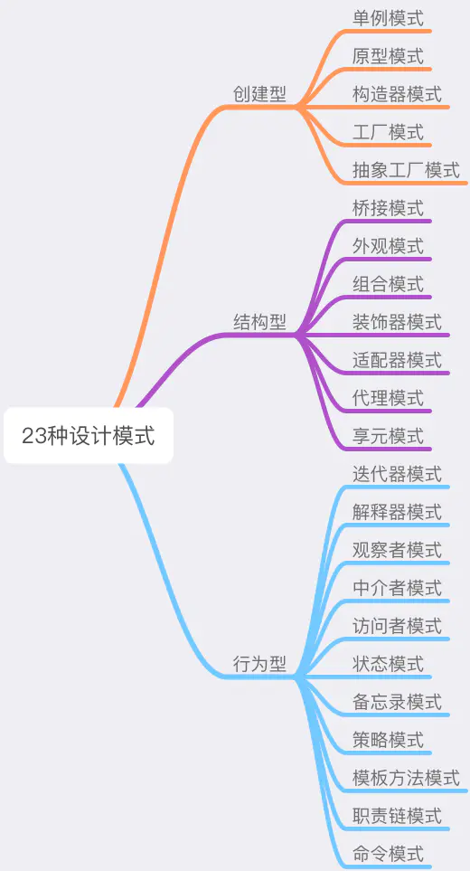

PS：

1. 本节为统领全书的纲要性章节，是后续多个章节的伏笔，因此不建议大家跳读
2. 另一方面，也**不建议大家死磕**
   ——有的东西你这会儿没看懂也没关系，正常
   ——接着往下看实战就完了，跟着做跟着跑，不知不觉你就会有“啊原来前面那个xx说的是这个xx啊”的奇妙感觉

## 设计模式之道

> 每一个模式描述了一个在我们周围**不断重复发生的问题**，以及**该问题的解决方案的核心**。这样，你就能一次又一次地使用该方案而不必做重复劳动。 —— Christopher Alexander

#### SOLID设计原则

> "SOLID" 是由罗伯特·C·马丁在 21 世纪早期引入的记忆术首字母缩略字，指代了**面向对象编程**和**面向对象设计**的五个基本原则。

1. **设计原则是设计模式的指导理论，可以帮助我们规避不良的软件设计**。SOLID指代的五个基本原则分别是：

   - 单一功能原则（Single Responsibility Principle）
   - 开放封闭原则（Opened Closed Principle）
   - 里氏替换原则（Liskov Substitution Principle）
   - 接口隔离原则（Interface Segregation Principle）
   - 依赖反转原则（Dependency Inversion Principle）

   ——在 JavaScript 设计模式中，主要用到的设计模式基本都围绕 ”单一功能“ 和 “开放封闭” 这两个原则来展开
   ——在没有实际操作的情况下，干讲理论没有任何意义，反而会挫伤初学者的积极性

#### 设计模式的核心思想——封装变化

1. 设计模式出现的背景，是软件设计的复杂度日益飙升。软件设计越来越复杂的“罪魁祸首”，就是**变化**。
   （1）如果说我们写一个业务，这个业务是一潭死水，初始版本是 1.0，100 年后还是 1.0，不接受任何迭代和优化，那么这个业务几乎可以随便写。反正只要实现功能就行了，完全不需要考虑可维护性、可扩展性。
   （2）但在实际开发中，不发生变化的代码可以说是不存在的。我们能做的只有将这个变化造成的影响**最小化** —— **将变与不变分离，确保变化的部分灵活、不变的部分稳定**。
   （3）这个过程，就叫“封装变化”；这样的代码，就是我们所谓的“健壮”的代码，它可以经得起变化的考验。而设计模式出现的意义，就是帮我们写出这样的代码。
   （4）换种说话，设计模式的核心操作时去观察你整个逻辑里面的**变与不变**，然后将变与不变分离，达到使变化的部分灵活、不变的地方稳定的目的。
2. 封装变化，封装的正式软件中那些不稳定的要素，它是一种防患于未然的行为——提前抽离了变化，就为后续的拓展提供了无限的可能性。如此，我们才能做到在变化到来的时候从容不迫。

## 设计模式的“术”

1. 所谓的”术“，其实就是指二十年前四位程序员前辈（Erich Gamma, Richard Helm, Ralph Johnson & John Vlissides，常被称为 Gang of Four，GOF：四人组） 提出的最经典的23种设计模式。

2. 设计模式的核心向，就是**“封装变化”**。无论是创建型、结构型还是行为型，这些具体的设计模式都是在用自己的方式去封装不同类型的变化
   （1）创建型模式：封装了**创建对象过程**中的变化（工厂模式：将创建对象的过程抽离）
   （2）结构型模式：封装了**对象之间组合方式**的变化，目的在于灵活地表达对象间的配合与依赖关系
   （3）行为型模式：将**对象千变万化的行为**进行抽离，确保我们能够更安全、更方便地对行为进行更改