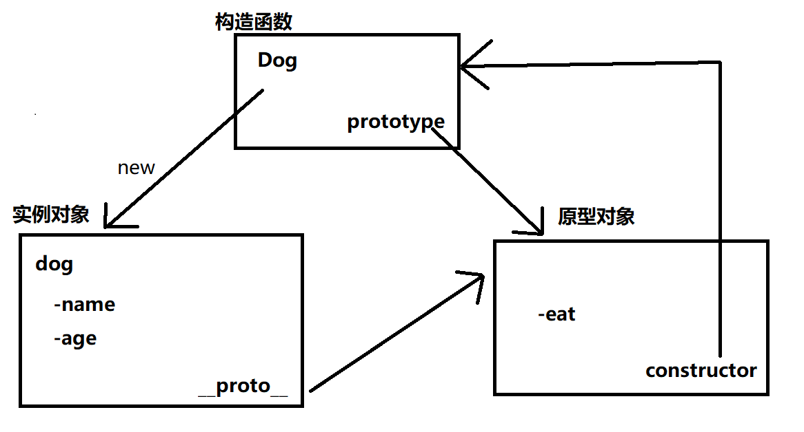
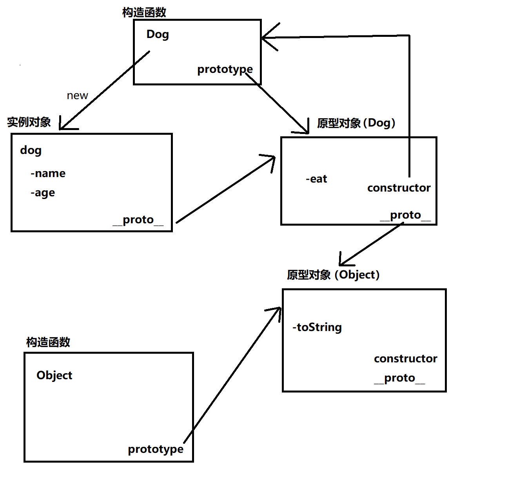

> 1. 原型模式不仅是一种设计模式，它还是一种**编程范式**（programming paradigm），是 JavaScript 面向对象系统实现的根基（根本）
> 2. 原型模式下，想要创建一个对象时，会先找到另一个对象作为原型，然后通过**克隆原型**的方式来创建出一个与原型对象一样的对象（**共享一套数据/方法**）
> 3. JavaScript 中，`Object.create` 方法就是原型模式的天然实现——**准确地说，只要我们还在借助 `Prototype`** 来实现对象的创建和原型的继承，那么我们就是在应用**原型模式**
> 4. 在 Java 中，确实存在原型模式相关的克隆接口规范。但是在 JavaScript 中，我们使用原型模式，并不是为了得到一个副本，而是为了得到与构造函数（类）相对应的类型的实例、实现数据/方法的共享——**克隆是实现这个目的的方法，但克隆本身并不是我们的目的**

## 以类为中心的语言 VS 以原型为中心得语言

1. 原型模式是 JavaScript 面向对象系统的根本——作为 JavaScript 开发者，原型模式**是一个必选项**
2. 类是 Java 面向对象系统的根本——在以类为中心的语言中，原型模式**不是一个必选项**，只有在特定的场景下才会登场
3. 在 Java 等强类型语言中，原型模式的出现是为了实现**类型之间的解耦**
4. 在 JavaScript 中，其本身类型就比较模糊，**不存在类型耦合的问题**，所以平时**根本不会刻意去使用原型模式**——正因为如此，我们不必强行把原型模式当作一种设计模式去理解，把它作为**一种编程范式**会更合适一些

#### JavaScript中的“类”

> MDN：ECMAScript 2015 中引入的 JavaScript 类实质上是 JavaScript 现有的**基于原型的继承**的语法糖。类语法不会为 JavaScript 引入新的面向对象的继承模型

```js
class Dog {
    constructor(name, age) {
        this.name = name;
        this.age = age;
    }
    
    eat() {
        console.log('肉骨头真好吃')
    }
}

// 等价写法

function Dog(name, age) {
    this.name = name;
    this.age = age;
}

Dog.prototype.eat = function() {
    console.log('肉骨头真好吃')
}
```

## 谈原型模式，其实是谈原型范式

1. 原型编程范式的**核心思想**：利用实例来描述对象，**用实例作为定义对象和继承的基础**
2. 在 JavaScript 中，原型编程范式的体现就是**基于原型链的继承**

#### 原型（在 JavaScript 中）

1. 每个构造函数都有一个 `prototype` 属性，其指向该构造函数的**原型对象**
2. 构造函数的原型对象有一个 `constructor` 属性，其指回构造函数本身
3. 每个实例都有一个 `__proto__` 属性，当使用构造函数去创建实例时，实例的 `__proto__` 属性就会**指向构造函数的的原型对象**

```js
// 创建一个Dog构造函数
function Dog(name, age) {
    this.name = name;
    this.age = age;
}

Dog.prototype.eat = function() {
    console.log('肉骨头真好吃')
}

// 使用Dog构造函数创建Dog实例
const dog = new Dog('旺财', 3)
```



#### 原型链

```js
// 输出"肉骨头真好吃"
dog.eat()

// 输出"[object, object]"
dog.toString()
```

> **命名没有在dog实例里手动定义 eat 方法和 toString 方法，但它们还是被成功地调用了？**
>
> ——当试图访问一个 JavaScript 实例的属性/方法时，首先搜索这个实例本身
>
> ——如果实例本身没有定义对应的属性/方法，会转而去搜索实例的原型对象
>
> ——如果原型对象中也没有定义对应的属性/方法，就会去搜索原型对象的原型对象
>
> **这个搜索的轨迹，就叫做原型链**



1. 几乎所有 JavaScript 中的对象都是位于原型链顶端的 Object 的实例

   （1）`Object.prototype` 是一个对象，但不是 Object 的实例

   （2）`Object.create(null)` 创建了一个没有任何原型的对象，也不是 Object 的实例

2. 在面试中，一些面试官可能会可以混淆 **JavaScript 中原型范式**和**强类型语言中原型模式**的区别，当他们这么做的时候不一定是因为对语言、对设计模式的理解有问题，而很有可能是为了考察你**对象的深拷贝**

## 对象的深拷贝

> **深拷贝没有完美的方案，每一种方案都有它的边界 case**

#### 序列化

```js
const liLei = {
    name: 'lilei',
    age: 28,
    habits: ['coding', 'hiking', 'running']
}

const liLeiCopy = JSON.parse(JSON.stringify(liLei))
```

1. 无法处理 function、正则等等
2. 只有当对象是严格的 JSON 对象时，可以顺利使用该方法

##### 递归

> 核心思想：若属性为值类型，则直接返回；若属性为引用类型，则递归遍历

```js
function deepClone(obj) {
    // 如果是值类型或null，直接return
    // typeof null === 'object'
    if(typeof obj !== 'object' || obj === null) {
        return obj
    }
    
    // 定义结果对象
    let copy = {}
    
    // 如果对象时数据，则定义结果数组
    if(obj.constructor === Array) {
        copy = []
    }
    
    
    // 遍历对象的key
    for(let key in obj) {
        // 如果key是对象的自有属性
        if(obj.hasOwnProperty(key)) {
            // 递归调用深拷贝方法
            copy[key] = deepClone(obj[key])
        }
    }
    
    return copy
}
```

#### 拓展阅读

1. 深拷贝在命题时，可发挥的空间主要在于针对不同**数据结构**的处理，比如除了考虑 Array、Object，还需要考虑如 Map、Set 等的其它数据结构
2. 此外还有一些极端 case（循环引用等）的处理

**（专题后续）**

