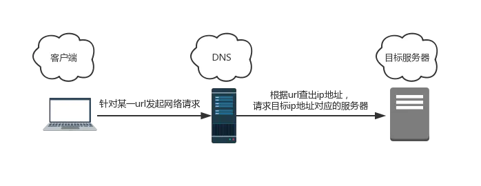
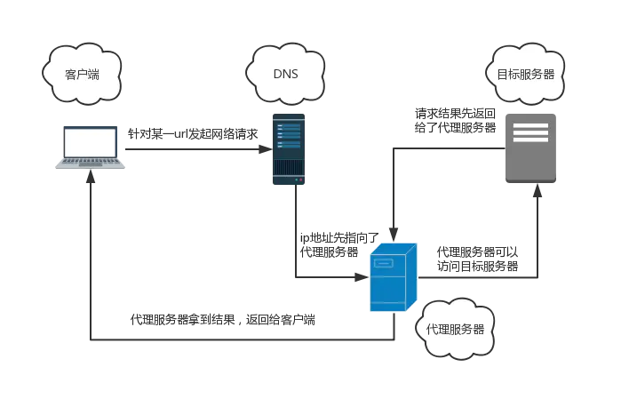

> **代理模式**：在某些情况下，处于种种考虑/限制，一个对象**不能直接访问**另一个对象，需要**第三者**（代理）牵线搭桥从而间接达到访问目的，这样的模式就是代理模式

## 科学上网背后的故事

#### 1. 正常访问



> 为了屏蔽某些网站，屏蔽规则会在DNS解析过程中作用于某些特定的 ip

#### 2. VPN访问



> 代理服务器（第三方）的 ip 地址不在被禁用的那批 ip 地址之列，因此可以顺利访问到代理服务器

## 用代理模式开一家婚姻介绍所

> 婚姻介绍所：用户不能直接与未知对象进行沟通，只能通过第三方（婚介所）间接获取对方的一些信息，能够获取到的信息和权限，取决于第三方愿意给用户什么——典型的代理模式

#### 前置知识：ES6中的Proxy

```js
const proxy = new Proxy(obj, handler)

// 第一个参数: 目标对象
// 第二个参数: 代理的行为对象
// 当通过 proxy 去访问目标对象时，handler 会对我们的行为作一层拦截
```

