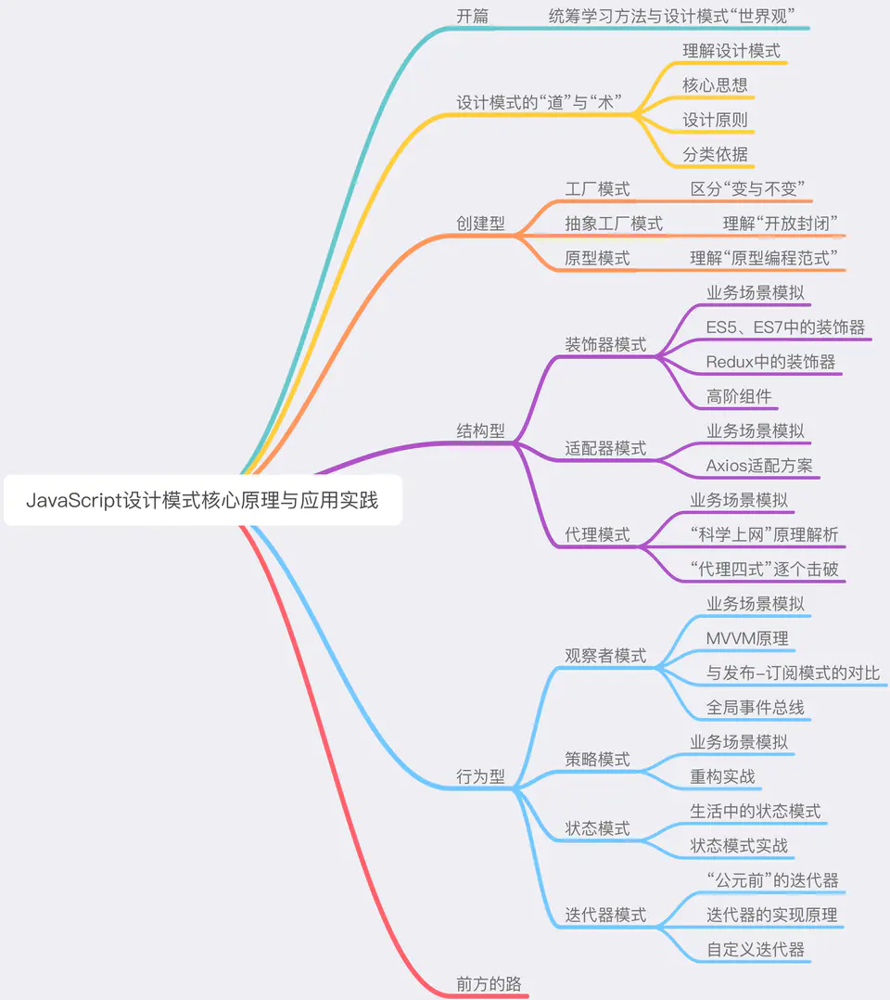

## 小册介绍

#### 1. 设计模式介绍

1. 在程序世界，编程的 "套路" 就是设计模式
2. 设计模式是一套现成的工具，它是 "拿来主义" 在软件领域的贯彻实践。和很多人的主观臆断相反，设计模式不是一堆空空如也、晦涩鸡肋的理论，它是一套现成的工具（用做数学题来打比方：比如一直直角三角形两边长，求另一边，我们会直接用勾股定理，而**并不需要每求一次边长都自己推一遍勾股定理**）
3. 设计模式本身是一帮非常苦逼的程序员在自己的职业生涯里实打实地踩坑踩出来的 —— 它是一个非常接地气、非常实际、非常好理解的东西
4. 维基百科：**在软件工程中，设计模式（design pattern）是对软件设计中普遍存在（反复出现）的各种问题，所提出的解决方案**
5. 设计模式的根本目的是为了使我们的代码具备更强的**应对变化**的能力

#### 2. 设计模式的学习

 1. 前端应用复杂度日新月异，其已经成为了软件思想的一种载体  ==>  前端工程师在掌握**多重专业技能**之余，也需要具备**最基本的软件理论知识**  ——  设计模式如今已经成为前端面试中无法回避、同时具有较高候选人区分度的一个核心考点（基于面试、工作的双重需要）

 2. 设计模式的 "难"，在于其令人望而生畏的**抽象性**和知识点的**分散性**
    （1）抽象性：

    ​	——抽象性几乎是所有理论性只是共有的特性，它带来最直观的问题就是可能一段话你**每个字都认识，但连在一起不知道它在说啥 :)**。于是产生了“这块知识看起来好牛逼，我一定学不会吧”这样的错觉。

    ​	——解决知识抽象性带来的理解障碍，重要的不是反复的陈述、解释，而是**把自己放到一个正确的场景里，去体会这个模式的好**
    （2）分散性

    ​	——分散性则是因为设计模式本身就是一套**解决不同问题**的方案的集合，这些方案之间乍一看好像没有什么关联，故而很容易使学习者陷入边学边忘的窘境

    ​	——所谓“分散性”其实也是纸老虎：深入了解设计模式后，大家会发现模式与模式间存在着不可忽略的共性与关联（**不同的设计模式并非是一座座的孤岛**，他们只见那彼此呼应、相互成就，共同构建起了一套完整而经典的软件思想体系）

#### 3. 本册介绍

1. 本册着重解决的问题：帮助大家摆脱枯燥乏味的技术恐惧感，最大程度上降低前端设计模式的学习成本
2. 本册中的每一个设计模式，都有它自己的一个 "故事"，有它自己的场景——本册的重点不在于对固有理论的反复阐述，而是**把读者放到一个正确的场景里、去体会每一个设计模式的好**（甚至贯穿设计模式始终的设计原则理论，也会被我们化解到具体的、易于理解的场景片段里去）
3. 本册的目的不是做传统设计模式书籍的 "译本"，而是面向前端工程师，讲有利于前端的技术。
4. 本册权衡了每种模式对前端的价值，对 23 种设计模式做了取舍，保留下来的设计模式具备两个共性：
   （1）前端能用，而且好用
   （2）面试会考，而且常考

## 记得总结