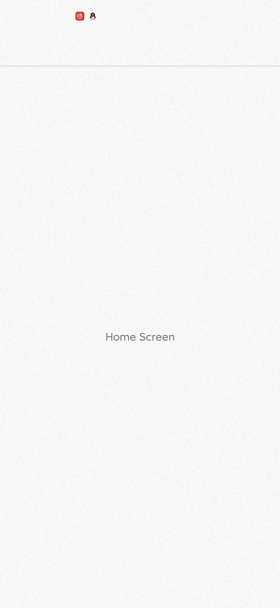

## Hello React Navigation（你好，React Navigation）

​	In a web browser, you can link to different pages using an anchor (&lt;a&gt;) tag. When the user clicks on a link, the URL is pushed to the browser **history stack**. When the user presses the back button, the browser pops the item from the top of the history stack, so the active page is now the previously visited page. 

> 在 web 浏览器中，可以使用锚标记（&lt;a&gt;）链接到不同的页面。当用户点击该链接时，该链接对应的 URL 会被 push 到浏览器的历史记录堆栈中。当用户按下返回按钮时，对应的项目会从浏览器的历史记录堆栈中 pop 出来，此时浏览器的活动页面时以前访问过的页面。

​	React  Native doesn't have a built-in idea of a global history stack like a web browser does —— this is where React Navigation enters the story.

> React Native 不像 web 浏览强那样具有内置的全局历史记录堆栈的概念，这也正是 React Navigation 得以开始的原因。

​	React Navigation‘s **stack navigator** provides a way for your app to transition between screens and manage navigation history. If your app uses only one stack navigator then it is conceptually similar to how a web browser handlers navigation state - your app pushes and pops items from the **navigation stack** as users iteract with it, and this results in the user seeing different screens. 

> React Navigation 的堆栈导航器为应用程序提供了一种切换屏幕和管理导航历史记录的方式。如果应用只使用一个堆栈导航器，那么它在概念上类似于 web 浏览器处理导航状态的方式：在用户与应用进行交互时，应用从导航堆栈中 push 和 pop 对应的项目，通过这种方式可以让用户看到不同的屏幕。

​	A key difference between how this works in a web browser and in React Navigation is that React Navigation's stack navigator provides the gestures and animations that you would expect on Android and iOS when navigating between routes in the stack.

> 堆栈在 web 浏览器和 React  Navigation 中的工作方式的主要区别在于，React Navigation 的堆栈导航器为 Android 和 iOS 都提供了理想的路由切换手势和动画。

​	Let's start by demonstrating the most common navigator, `createStackNavigator`.

> 让我们从演示最常见的导航器 —— createStackNavigator 开始。

## Creating a stack navigator（创建堆栈导航）

​	`createStackNavigator` is **a function that returns a React component**. It takes **a route configuration object** and, optionally, **an options object** (we omit this below, for now). Because the `createStackNavigator` function returns a React component, we can export it directly from `App.js` to be used as our App's root component.

> `createStackNavigation` 是一个返回 React 组件的函数，它接收一个**路由配置对象**和一个**可选的选项对象**（我们在下面暂时省略）作为参数。因为 `createStackNavigator` 函数返回一个 React 组件，所以我们可以在 `App.js` 中直接导出它用作我们应用程序的根组件

```js
// In App.js in a new project

import React, { Component } from 'react'
import {
    View,
    Text,
} from 'react-native'
import { createStackNavigator, createAppContainer } from 'react-navigation'

class HomeScreen extends Component {
    render() {
        return (
        	<View style={{ flex: 1, alignItems: "center", justifyContent: "center" }}>
            	<Text>Home Screen</Text>
            </View>
        )
    }
}

const AppNavigator = createStackNavigator({
    Home: {
        screen: HomeScreen
    }
})

export default createAppContainer(AppNavigator)
```

​	If you run this code, you will see a screen with an empty navigation bar and a white content area containing your `HomeScreen` component. The styles you see for the navigation bar and the content area are the default configuration for a stack navigator, we'll learn how to configure those later.

> 如果你运行上述代码，你将看到一个空白导航栏和一个包含在 `HomeScreen` 内的白色内容区域的屏幕。你所看到的导航栏和内容区域的样式是堆栈导航器的默认配置，我们稍后将学习如何配置它们。



​	The casing of the route name doesn't matter —— you can use lowercase `home` or capitalized `Home` ，it's up to you. We prefer capitalizing out route names.

> 路由名称的大小写无关紧要——你可以使用小写 `home` 或 大写 `Home`，这取决于你。但我们更倾向于将路由名称大写。

​	The only required configuration for a route is the `screen` component. You can read more about the other options available in the [StackNavigator reference](https://reactnavigation.org/docs/3.x/stack-navigator).

> **路由唯一需要的配置是 `screen` 组件。**你可以在 "StackNavigator reference" 中阅读更多有关其他可用选项的信息。

In React Native, the component exported from `App.js` is the entry point (or root component) for your app —— it is the component from which every other component descends. It's often useful to have more control over the component at the root of your app than you would get from exporting the result of `createAppContainer`, so let's export a component that just renders out `AppNavigator` stack navigator.

> 在 React Native 中，从 `App.js` 导出的组件是应用程序的入口（或根组件）—— 所有其他组件都是其后代组件。与其控制 `createAppContainer` 导出的结果，对应用程序根部的组件进行控制通常是更有用的，因此我们导出一个仅渲染 `AppNavigator` 堆栈导航器的组件。

```js
import React, { Component } from 'react'
import {
    View,
    Text,
} from 'react-native'
import { createStackNavigator, createAppContainer } from 'react-navigation'

class HomeScreen extends Component {
    render() {
        return (
        	<View style={{ flex: 1, alignItems: "center", justifyContent: "center" }}>
            	<Text>Home Screen</Text>
            </View>
        )
    }
}

const AppNavigator = createStackNavigator({
    Home: {
        screen: HomeScreen
    }
})

// 减去
// export default createAppContainer(AppNavigator)

// 新增
const AppContainer = createAppContainer(AppNavigator)

// 新增
export default class App extends Component {
  render() {
    return <AppContainer />
  }
}
```

## Route configuration shorthand（路由配置速记）

​	Given that the only route configuration we have for `Home` is the screen component, we don't nedd to use the `{ screen: HomeScreen }` configuration format, we can use the screen component directly.

> 鉴于我们唯一拥有的路由配置 `Home` 是屏幕组件，所以我们不需要使用 `{ screen: HomeScreen }` 配置格式，而可以直接使用屏幕组件（读者：此处只是简化了格式，由一个对象`{ screen: HomeScreen }`直接变成了一个组件`HomeScreen`）。

```js
const AppNavigator = createStackNavigator({
    Home: HomeScreen
})
```

## Adding a second route（添加第二个路由）

​	The `<AppContainer />` component doesn't accept any props —— all configurationn is specified in the `options` parameter to the `AppNavigator` `createStackNavigator` function. We left the `options` blank, so it just uses the default configuration. To see an example of using the `options` object, we will add a second screen to the stack navigator.

> `<AppContainer />` 不接受任何 props —— 所有的配置都在函数 `AppNavigator`  和 `createStackNavigator`的 `options` 参数中指定。（上述配置中）我们没有配置 `options` 参数，所以它使用了默认配置。想要看使用 `options` 对象的示例，我们需要向堆栈导航器添加第二个屏幕。

```js
// Other code for HomeScreen here...

class DetailsScreen extends Component {
    render() {
        return (
        	<View style={{ flex: 1, alignItems:"center", justifyContent: "center"}}>
            	<Text>Details Screen</Text>
            </View>
        )
    }
}

const AppNavigator = createStackNavigator(
	{
        Home: HomeScreen,
        Details: DetailsScreen
    },
    {
        initialRouteName: 'Home'
    }
)

// Other code for App component here...
```

​	Now our stack has two routes, a `Home` route and a `details` route. The `Home` route corresponds to the `HomeScreen` component, and the `Details` route corresponds to the `DetailsScreen` component. The initial route for the stack is the `Home` route. The natural question at this point is: "how do I go from the Home route to the Details route?". That is covered in the next section.

> 现在我们的堆栈有两个路由：一个 `Home` 路由和一个 `Details` 路由。`Home` 路由对应 `HomeScreen` 组件，`Details` 路由对应 `DetailsScreen` 组件。堆栈的初始路由是 `Home` 路由。此时我们自然会问：如何从 Home 路由跳转到 Details 路由？下一部分将对此进行介绍。

## Summary（总结）

- React Native doesn't have a built-in API for navigation like a web browser does. React Navigation provides this for you, along with the iOS and Android gestures and animations to transition between screens.
- `createStackNavigator` is a function that takes a route configuration object and an options object and returns a React component.
- The keys in the route configuration object are the route names and the values are the configuration for that route. **The only required property on the configuration is the `screen` (the component to use for the route)**
- To specify what the initial route in a stack is, provide an `initialRouteName` on the stack options object.

> 1. React  Native 没有像 web 浏览器那样的内置 API 用于导航。React Navigation 不仅为 React Native 提供了此功能，而且为 iOS 和 Android 都提供了屏幕切换的手势和动画
> 2. `createStackNavigator` 是一个函数，它接收一个路由配置对象和一个选项对象作为参数，并返回一个 React  组件
> 3. 路由配置对象中的键（key）是路由名称，值（value）是该路由的配置：配置中唯一需要的属性是 `screen` ——用于路由的组件
> 4. 要指定堆栈的初始路由，需要为堆栈选项对象提供 `initialRouteName` 配置