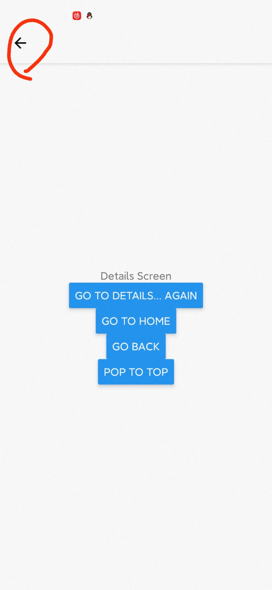

## Moving between screens（在屏幕之间移动）

​	In the prvious section, "Hello React Navigation", we defined a stack navigator with two routes (`Home` and `Details`), but we didn't learn how to let a user navigate from `Home` to `Details` (although we did learn how to change the initial route in our code, but foring our users to clone our repository and change the route in our code in order to see another screens is arguably among the worst user experiences one could imagine).

> 在上一节 "Hello React Navigation" 中，我们定义了一个包含两个路由（`Home` 和 `Details`）的堆栈导航器，但是我们没有学习如何让用户从 `Home` 导航到 `Details`（我们只学习了在我们的代码中更改初始路由，但是为了能看到另一个屏幕强迫用户克隆我们的存储库并更改代码中的路由无疑是可能想到的最糟糕的用户体验

​	If this was a web browser, we'd be able to write something like this:

> 如果这是一个网络浏览器，我们将能够编写如下代码：

```js
<a href="details.html">Go to Details</a>
```

​	Another way to write this would be:

> 另一种写法是：

```js
<a onClick={() => document.location.href = "details.html"}>Go to Details</a>
```

​		We'll do something similar to the latter, but rather than using a `document` global we'll use the `navigation` prop that is passed down to our screen components.

> 我们（React Navigation）将执行与后者相似的操作，但不是使用 `document` 全局变量，而是使用 `navigation` prop 传递到我们定义的屏幕组件（screen components）

### Navigating to a new screen（导航到另一个屏幕）

```js
import React, { Component } from 'react'
import {
    View,
    Text,
    Button
} from 'react-native'
import { createStackNavigator, createAppContainer } from 'react-navigation'

class HomeScreen extends Component {
    render() {
        return (
        	<View>
            	<Text>Home Screen</Text>
            	<Button
            		title="Go to Details"
            		onPress={() => this.props.navigation.navigate('Details')}
            	/>
			</View>
        )
    }
}

// ...other code from the previous section
```

​	Let's break this down:

> 让我们来分解一下：

- `this.props.navigation`: the `navigation` props is passed in to every screen component in stack navigator (more about this later in  ["The navigation prop in depth"](https://reactnavigation.org/docs/3.x/navigation-prop)

> `this.props.navigation`：将 `navigation` prop 传递到堆栈导航器中的每个屏幕组件（关于屏幕组件的更多信息，请参见 "The navigation prop in deepth"

- `navigata('Details')`: we call the `navigate` function (on the `navigation` prop —— naming is hard!) with the name of the route that we'd like to move the user to.

> `navigata('Details')`：我们调用 `navigate` 函数（`navigate` 是 `navigation `的属性——命名是如此的艰难！）并根据传递的路由名称参数实现用户跳转导航

  If we call `this.props.navigation.navigate` with a route name that we haven't defined on a stack navigator, nothing will happen. Said another way, we can only navigate to routes that have been defined on our stack navigator —— we cannot navigate to an arbitrary component.

> 如果我们给 `this.props.navigation.navigate` 传递一个未在堆栈导航器上定义的路由名称参数并进行调用，那么不会发生任何事情。换句话说，我们只能浏览到已经在我们的堆栈导航器定义的路由——我们并不能导航到任意组件

  	So we now have a stack with two routes: 1) the Home route; 2) the Details route. What would happen if we navigated to the Details route again, from the Details screen?

> 现在，我们有了一个包含两个路由的堆栈：1）`Home` 路由；2）`Details` 路由。如果从 `Details` 路由再次导航到 `Details` 路由又会发生什么呢？

### Navigate to a route multiple times（多次导航到同一个路由）

```js
class DetailsScreen extends Component {
    render() {
        return (
        	<View style={{ flex: 1, alignItems: "center", justifyContent: "center" }}>
            <Text>Details Screen</Text>
            <Button
				title="Go to Details... again"
				onPress={() => this.props.navigation.navigate('Details')}
            />
          </View>
        )
    }
}
```

​	If you run this code, you'll notice that when you tap "Go to Details... again" that it doesn't do anything! This is because we are already on the `Details` route. The `navigate` function roughly means "go to this screen", and if you are already on that screen then it makes sense that it would do nothing.

> 如果运行上述代码，你会注意到，当你点击 "Go to Details... again" 时，它不会执行任何操作！这是因为我们已经在 `Details` 路由上了。`navigate` 函数实现的功能大致可以表明为 "转到指定的屏幕"，因此如果你已经在指定的屏幕上，那么什么都不做是正确的。

​	Let's suppose that we actually want to add another details screen. This is pretty common in cases where you pass in some unique data to each route (more on that later when we talk about `params`!). To do this, we can change `navigate` to `push`. This allows us to express the intent to add another route regardless of the exiting navigation history.

> 假设我们实际上要添加另一个 `Details` 屏幕——在向每个路由传递一些唯一数据的情况下，这是很常见的（更多讲解在稍后讨论的 `params`中）——为此，我们可以将 `navigate` 更改为 `push`。这样，无论我们现有的导航历史如何，我们都可以实现添加另一个路由的意图。

```js
<Button
	title={Go to Details... again}
	onPress={() => this.props.navigation.push('Details')}
/>
```

​	Each time you call `push` we add a new route to the navigation stack. When you call `navigate` it first to find an exiting route with that name, and only pushes a new route if there isn't yet one on the stack.

> 每当你调用 `push`时，都会向导航堆栈添加一条新的路由。而当你调用 `navigate` 时，首先在现有路由中尝试查找具有指定路由名称参数的路由，并且仅在堆栈中还没有该路由时才 `push` 新路由

### Going back（路由返回）

​	The header provided by stack navigator will automatically include a back button when it is possible to go back from the active screen (if there is only screen in the navigation stack, there is nothing that you can go back to, and so there is no back button).

> 当可以从当前屏幕进行返回操作时，堆栈导航器提供的标题将自动包括一个返回按钮（如果导航堆栈中只有一个屏幕，则无法返回任何内容，因此没有返回键）




​	Sometimes you'll want to be able to programmatically trigger this behavior, and for that you can use `this.props.navigation.goBack()`

> 有时，你可能希望以编程方式触发此行为，为此可以使用`this.props.navigation.goBack()`

```js
class DetailsScreen extends Component {
  render() {
      return (
        <View style={{ flex: 1, alignItems: "center", justifyContent: "center" }}>
            <Text>Details Screen</Text>
            <Button
				title="Go to Details... again"
				onPress={() => this.props.navigation.push('Details')}
            />
            <Button
				title="Go to Home"
				onPress={() => this.props.navigation.navigate('Home')}
            />
            <Button
				title="Go back"
				onPress={() => this.props.navigation.goBack()}
            />
			<Button
				title="pop to top"
				onPress={() => this.props.navigation.popToTop()}
            />
          </View>
      )
  }
}
```

​	on Android, React Navigation hooks in to the hardware back button and fires the `goBack()` function for you when the user presses it, so it behaves as the user would expect.

> 在 Android 上，React Navigation 将 `goBack()` 函数挂接到了硬件的返回按钮，当用户点击点击了硬件的返回按钮时，会同时触发 `goBack()` 函数，所以其表现与用户期望的一样

​	Another common requirement is to be able to go back multiple screens —— for example, if you are several screens deep in a stack and want to dismiss all of them to go back to the first screen. In this case, we know that we want to go back to `Home` so we can use `navigate('Home') `(not `push` ! try that out and see the difference). Another alternative would be `navigation.popToTop()`, which goes back to the first screen in the stack.

> 另一个常见的要求是能够返回多个屏幕——例如，如果在堆栈中有多个屏幕，当想要释放所有屏幕来返回到第一个屏幕时。在这种情况下，如果我们知道我们想要返回的第一个屏幕是 `Home`，那么我们可以使用 `navigate('Home')`（不是 `push`！试试看有什么不同）另一个选择是 `navigation.popToTop()`，它可以返回到堆栈中的第一个屏幕（而不必知道堆栈中的第一个屏幕是什么）

### Summary（总结）

- `this.props.navigation.navigate('RouteName')`: pushes a new route to the stack navigator if it's not already in the stack, otherwise it jumps to that screen.
- We can call `this.props.navigation.push('RouteName')` as many times as we like and it will continue pushing routes
- The header bar will automatically show a back button, but you can programmatically go back by callinng `this.props.navigation.boBack()`. On Android, the hardware back button just works as expected.
- You can go back to an existing screen in the stack with `this.props.navigation.navigate('RouteName')`, and you can go back to the first screen in the stack with `this.props.navigation.popToTop()`
- The `navigation` props is available to all screen components (component defined as screens in route configuration and rendered by React Navigation as a route).

> 1. `this.props.navigation.navigate('RouteName')`：将新的路由 `push` 到堆栈导航器（如果尚未在堆栈中），另外，跳转到该路由对应的屏幕
> 2. 我们可以调用`this.props.navigation.push('RouteName')`函数我们需要的任意次数，它会持续 `push` 路由（到导航堆栈）
> 3. 标题栏将自动显示一个返回按钮，我们也可以通过`this.props.navigation.boBack()`的编程方式来进行返回。在 Android 上，硬件的返回按键如预期工作
> 4. 你可以通过`this.props.navigation.navigate('RouteName')`返回到堆栈中现有屏幕，可以通过 `this.props.navigation.popToTop()`返回到堆栈的第一个屏幕
> 5. `navigation` props 可用于所有屏幕组件（在路由配置中定义为屏幕并由 React Navigation 作为路由渲染的组件）

