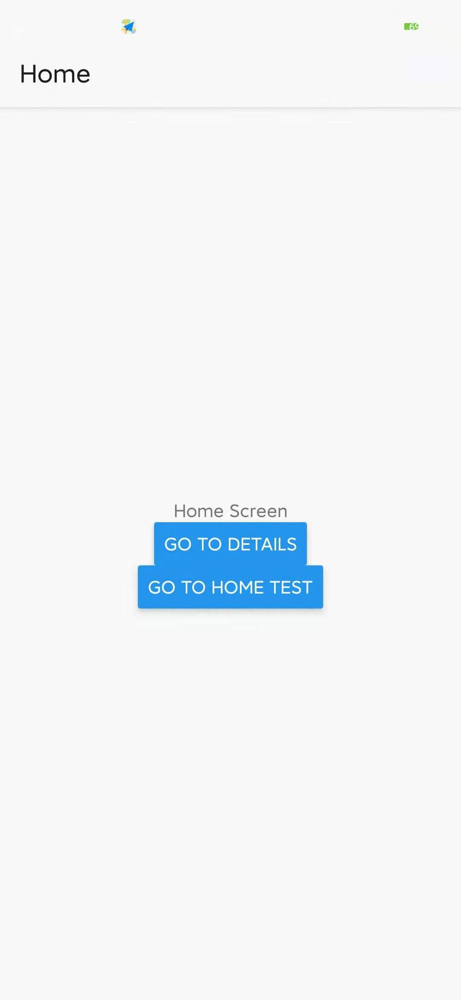
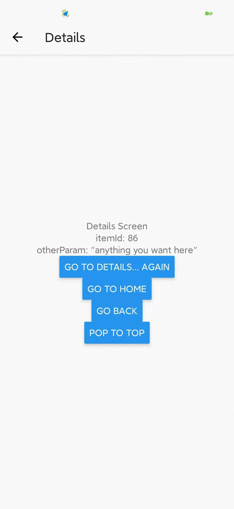

## Configuring the header bar（配置标题栏）

​	By now you're probably tired of seeing a blank grey bar on the top of your screen —— you're ready for some flair. So let's jump in to configuring the header bar.

> 到目前为止，你可能已经厌倦了屏幕顶部的空白的灰色栏 —— 你已经准备好进行一些改进了。让我们开始配置标题栏。

### Setting the header title（设置头部标题）

​	A screen component can have a static property called `navigationOptions` which is either an object or a function that returns an object that contains various configuration options. The one we use for the header title is `title`, as demonstrated in the following example.

> 屏幕组件具有一个静态属性 `navigationOptions`，该属性可以是对象，也可以是一个返回包含各种配置选项的对象的函数。我们用于设置头部标题的属性是 "title"，如下实例所示：

```js
class HomeScreen extends Component {
    static navigationOptions = {
		title: 'Home'
	}

	/* render function, etc */
}

class DetailsScreen extends Component {
    static navigationOptions = {
		title: 'Details'
	}

	/* render function, etc */
}
```





​	`createStackNavigator` uses platform conventions by default, so on iOS the title will be centered and on Android it will be left-aligned.

> `createStckNavigator` 默认情况下使用平台约定，因此在 iOS 上标题将居中，在 Android 上，标题将左对齐。

### Using params in the title（在标题中使用 params）

​	In order to use params in the title, we need to make `navigationOptions` a function that returns a configuration object. It might be tempting to try to use `this.props` inside of `navigation`, but because it is a static property of the component, `this` does not refer to an instance of the component and therefore no props are avialiable.

> 为了在标题中使用 params，我们需要创建 `navigation` —— 一个返回配置对象的函数 —— 尝试在 `navigationOptions` 中使用 `this.props` 可能很具有吸引力，但是由于 `navigationOptions` 是组件的一个静态属性，因此 `this` 并不引用组件的实例，也因此 `props` 是不可用的。

​	 Instead, if we make `navigationOptions` a function then React Navigation will call it with an object containing `{ navigation, navigationOptions, screenProps }` —— in this case, all we care about is `navigation`, which is the same object that is passed to your screen props as `this.props.navigation`. 

> 相反，如果我们创建一个 `navigationOptions` 函数，那么 React Navigation 会使用参数 `{navigation, navigationOptions, screenProps }` 来调用它 —— 此时，我们所关注到的 `navigation` ，正是传递给屏幕的 props 对象中的 `this.props.navigation` 。

​	You may recall that we can get the params from `navigation` through `navigation.getParam` or `navigation.state.params`, and so we do this below to extract a param and use it as a title.

> 你可能还记得我们可以通过 `navigation` 中的 `navigation.getParam` 或 `navigation.state.params` 来获取参数，因此我们在下面从 `navigation` 中提取出一个参数并使用它作为标题。

```js
class DetailsScreen extends Component {
    static navigationOptions = ({ navigation }) => {
        return {
            title: navigation.getParam('otherParam', 'A Nested Details Screen')
        }
    }
    
    /* render funciton, etc */
}
```

​	The argument that is passed in to the `navigationOptions` function is an object with the following properties: 

- ​	`navigation`：The [navigation prop](https://reactnavigation.org/docs/3.x/navigation-prop) for the screen, with the screen's route at `navigation.state`

  ```js
  navigation.state = {
      "key": "id-1606629762600-1", 
      "params": {
          "itemId": 86, 
          "otherParam": "anything you want here"
      },
      "routeName": "Details"
  }
  ```

- `screenProps`：The props passing from above the navigator component

- `navigationOptions`：The default or previous options that would be used if new values are not provided

> 传递给 `navigationOptions` 函数的参数是具有以下属性的对象：
>
> 1. `navigation`：屏幕的 `navigation` prop，在 `navigation.state` 中包含屏幕的路由
> 2. `screenProps`：从之前的导航器组件传递过来的 props
> 3. `navigationOptions`：如果没有提供新值，则将使用默认或先前的选项

  We only needed the `navigation` prop in the above example but you may in some cases want to use `screenProps` or `navigationOptions` 

> 在上面的示例中，我们只需要 `navigation` prop，但是在某些情况下，你可能会需要使用 `screenProps` 或者 `navigationOptions`

### Updating `navigationOptions` with `setParams`（通过 `setParams` 更新 `navigationOptions`

​	It's often necessary to update the `navigationOptions` configuration for the active screen from the mounted screen component itself. We can do this using `this.props.navigation.setParams`

> 通常需要更新已装载的屏幕组件的活动屏幕的 `navigationOptions` 配置。我们可以使用 `this.props.navigation.setParams`

```js
/* Inside of render() */
<Button
	title="Update the title"
	onPress={() => this.prop.navigation.setParams({otherParam: 'updated!'})}
 />
```

### Adjusting header styles

​	There are three key properities to use when customizing the style of your header: `headerStyle`, `headerTintColor`, and `headerTitleStyle`.

- `headerStyle`: a style object that will be applied to the `View` that wraps the header. If you set `backgroundColor` on it, that will be the color of your header.
- `headerTintColor`: the back button and title both use this property as their color. In the example blow, we set the tint color to white (`#fff`) so the back button and the header title would be white.
- `headerTitleStyle`: if we want to customize teh `fontFamily`, `fontWeight` and other `Text` style properties for the title, we can use this to do it.

> 定制标题栏风格时，有三个关键属性`headerStyle`, `headerTintColor`, 和 `headerTitleStyle`.
>
> 1. `headerStyle`：一个样式对象，该样式对象将应用于包裹标题栏的 `<View>` 组件，如果在其中设置了 `backgroundColor` ，则该颜色将成为标题栏的背景色
> 2. `headerTintColor`：返回按钮和标题文字都是用此属性作为其颜色。在下面的示例中，我们将颜色设置为白色（`#fff`），所以返回按钮和标题文字的颜色都是白色
> 3. `headerTitleStyle`：如果我们想要自定义标题的 `fontFamily`，`fontWeight` 以及其他 `Text` 样式属性，可以使用 `heaerTitleStyle` 来实现
>
> 读者注：`headerTitleStyle` 中的设置的 `color` 会覆盖 `headerTintColor` 的设置，而不管其代码的先后顺序；另外，如果当前屏幕并没有返回按钮，headerTintColor`设置的颜色也是无意义的

```js
class HomeScreen extends React.Component {
  static navigationOptions = {
    title: 'Home',
    headerStyle: {
      backgroundColor: '#f4511e',
    },
    headerTintColor: '#fff',
    headerTitleStyle: {
      fontWeight: 'bold',
    },
  };

  /* render function, etc */
}
```

​	There are a couple of things to notice here:

		1. on iOS, the status bar text and icons are black, and this doesn't look great over a dark-colored background. We won't discuss it here, but you should be sure to configue the status bar to fit with your screen as describe in the [status bar](https://reactnavigation.org/docs/3.x/status-bar) guide.
  		2. The configuration we set only applies to the home screen; when we navigate to the details screen, the default styles are back. We'll look at how to share `navigationOptions` between screens now.

> 这里有几件事要注意：
>
> 	1. 在 iOS 上，状态栏的文本和图标为黑色，这在深色背景下看起来不太好。我们不会在这里讨论它，但是你应该确保按照状态栏指南中的说明将状态栏配置为适合你的屏幕颜色
>  	2. 我们设置的配置仅应用到了 `Home` 屏幕；当我们导航到 `Details` 屏幕时，又是默认样式了。现在，我们将研究如何在屏幕之间共享 `navigationOptions` 配置

### Sharing common `navigationOptions` across screens（跨屏幕共享共同的 `navigationOptions` 配置）

​	It is common to want to configue the header in a similar way across many screens. For example, your company brand color might be red and so you wan the header background color to be red ant tint color to be white. Conveniently, these are the colors we're using in our running example, and you'll notice that when you navigate to the `DetailsScreen` the colors go back to the defaults.

> 通常希望在多屏幕上以一种类似的方式配置标题。例如，你的公司品牌的颜色可能是红色，因此你希望标题的背景颜色为红色，而字体颜色为白色。正好，这些配置是我们上面示例中使用的颜色。然而，你会注意到，当我们导航到 `DetailsScreen` 时，这些颜色会返回到默认值

​	Wouldn't it be aweful if we had to copy the `navigationOptions` header style properties from `HomeScreen` to `DetailsScreen`, and for every single screen component we use in our app? Thankfully, we do not. We can instead move the configuration up to the stack navigator under the property `defaultNavigationOptions`.

> 如果需要将 `HomeScreen` 的 `navigationOptions` 标题样式属性复制到 `DetailScreen` ，你不觉得这太糟糕了吗？幸运的是，我们并不需要这样。相反，我们可以将配置移动到堆栈导航器中的 `defaultNavigationOptions` 属性中

```js
class HomeScreen extends React.Component {
  static navigationOptions = {
    title: 'Home',
    /* No more header config here! */
  };

  /* render function, etc */
}

/* other code... */

const RootStack = createStackNavigator(
  {
    Home: HomeScreen,
    Details: DetailsScreen,
  },
  {
    initialRouteName: 'Home',
    /* The header config from HomeScreen is now here */
    defaultNavigationOptions: {
      headerStyle: {
        backgroundColor: '#f4511e',
      },
      headerTintColor: '#fff',
      headerTitleStyle: {
        fontWeight: 'bold',
      },
    },
  }
);
```

​	Now, any screen that belongs to the `RootStack` will have our wonderful branded styles. Surely though, there must be a way to override these options these options if we need to?

> 现在，属于 `RootStack` 中的任何屏幕都将具有我们配置的品牌风格。当然，也必须存在一种可以覆盖这些配置的方法。

​	Note: In v2 and below, the property you would want to use to do this is `navigationOptions`. In v3 we've renamed this to `defaultNavigationOptions`.

> 注意：在v2及以下版本中，您要使用的属性是`navigationOptions`。在v3中，我们已将其重命名为`defaultNavigationOptions`。

​	The property `navigationOptions` can be used to configue the navigator itself: 

> `navigationOptions` 属性可用于配置导航器本身：

```js
const Home = createStackNavigator(
  {
    Feed: ExampleScreen,
    Profile: ExampleScreen,
  }, {
    defaultNavigationOptions: {
      headerTintColor: '#fff',
      headerStyle: {
        backgroundColor: '#000',
      },
    },
    navigationOptions: {
      tabBarLabel: 'Home!',
    },
  }
);

const Tabs = createBottomTabNavigator({ Home });
```

### Overriding shared `navigationOptions`（覆盖共享的 `navigationOptions`）

​	The `navigationOptions` specified on your screen component are merged together with the default navigation options of its parent stack navigator, with the options on the screen component taking precedence. Let's use this knowledge to invert the background and tint colors on the details screen.

> 屏幕组件指定的 `navigationOptions` 与父堆栈导航器的默认导航选项合并在一起，屏幕组件上的选项优先。让我们使用这些知识来交换`Details`屏幕的背景颜色和字体颜色。 

```js
class DetailsScreen extends React.Component {
  static navigationOptions = ({ navigation, navigationOptions }) => {
    const { params } = navigation.state;

    return {
      title: params ? params.otherParam : 'A Nested Details Screen',
      /* These values are used instead of the shared configuration! */
      headerStyle: {
        backgroundColor: navigationOptions.headerTintColor,
      },
      headerTintColor: navigationOptions.headerStyle.backgroundColor,
    };
  };

  /* render function, etc */
}
```

### Replacing the title with a custom component（用自定义组件替换标题）

​	Sometimes you need more control than just changing the text and styles of your title —— for example, your may want to render an image in place of the title, or make the title into a button. In these cases you can completely override the component used for the title and provide your own.

> 有时，你需要的控制不仅仅是更改标题的文本和样式——例如，你可能需要渲染图像来代替标题，或将标题变成按钮。在这些情况下，你可以完全覆盖掉用于标题的组件并提供你自己的组件。

```js
class LogoTitle extends React.Component {
  render() {
    return (
      <Image
        source={require('./spiro.png')}
        style={{ width: 30, height: 30 }}
      />
    );
  }
}

class HomeScreen extends React.Component {
  static navigationOptions = {
    // headerTitle instead of title
    headerTitle: <LogoTitle />,
  };

  /* render function, etc */
}
```

​	You might be wondering, why `headerTitle` when we provide a component and not `title`, like before? The reason is that `headerTitle` is a property that is specific to a stack navigator, the `headerTitle` defaults to a `Text` component that displays the `title`.

> 你可能想知道，为什么在提供组件时使用 `headerTitle`，而不是像以前那样使用 `title`。原因是 `headerTitle` 是一个特定于堆栈导航器的属性，`headerTitle` 默认为显示 `title` 的 `Text` 组件

### Additional configuration（其他配置）

​	You can read the full list of available `navigationOptions` for screens inside of a stack navigator in the [`createStackNavigator` reference](https://reactnavigation.org/docs/3.x/stack-navigator#navigationoptions-used-by-stacknavigator).

> 你可以在 `createStackNavigator` 参考中了解堆栈导航器内部的屏幕可用的完整列表

### Summary（总结）

- You can customize the header inside of the `navigationOptions` static property on your screen components. Read the full list of options [in the API reference](https://reactnavigation.org/docs/3.x/stack-navigator#navigationoptions-used-by-stacknavigator).
- The `navigationOptions` static property can be an object or a function. When it is a function, it is provided with an object with the `navigation` prop, `screenProps`, and `navigationOptions` on it.
- You can also specify shared `navigationOptions` in the stack navigator configuration when you initialize it. The static property takes precedence over that configuration.

> 1. 你可以在屏幕组件的静态属性 `navigationOptions` 中自定义标题栏。阅读 API 参考中完整列表
> 2. 静态属性 `navigationOptions` 可以是一个对象或一个函数。当它是一个函数时，它提供了一个带有 `navigation` prop、`screenProps` 和 `navigationOptions` 的对象
> 3. 你还可以在初始化时，在堆栈导航器配置中，指定共享的 `navigationOptions`。但是，屏幕组件的静态属性优先于该配置。