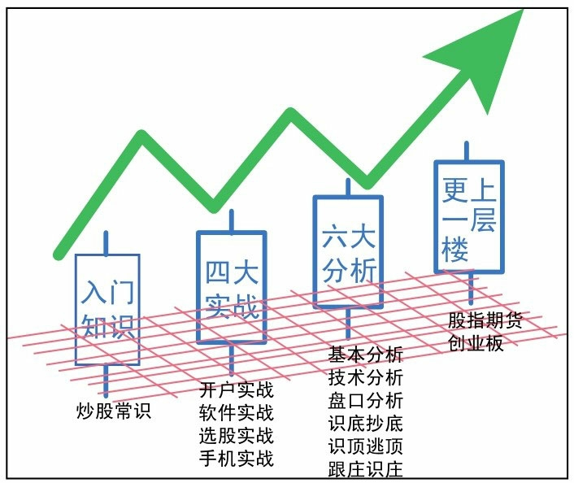

## 内容提要

读者定位：

（1）刚刚进行网上炒股但实战经验较少的股民

（2）股票投资爱好者

（3）希望通过牛熊市操盘技巧提高自己稳步盈利能力的投资者

（4）作为大中专院校或者企业的网上炒股教材

（5）作为证券公司、基金公司等培训、指导客户和与客户沟通时的读本

## 前言

1. 正确的炒股技巧可以提高**股价运行趋势预测**的准确性，从而直接影响投资者的投资成功或失败
2. 本书知识结构：
   

3. 股票投资的技巧和方法不计其数，本书罗列的技术和方法比较全面，股民**不需要全部掌握**，可**有针对性地挑选**几种技术深入学习并**不断总结**，在**实战中进行综合运用**，即可达到很好的投资效果
   读者在阅读中还应结合实际情况灵活变通，举一反三，养成勤思考的好习惯，形成良好的归纳总结能力

